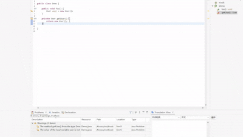

# Generate All Set Method

This plugin generates call to setter method value for class.

## Feature  
- Generate local variable assignments from an object's getters (Generate all getter).
- Generate setter calls without default values (Generate all setter no default value).
- Generate setter calls with sensible default values (Generate all setter with default value).
- Generate a converter block inside a method body that creates a new object, calls setters, and returns it (Generate setter getter converter).

## Use  


## Build

This project uses [Tycho](https://github.com/eclipse-tycho/tycho) with [Maven](https://maven.apache.org/) to build. It requires Maven 3.9.0 or higher version.

Dev build:

```
mvn clean verify
```

Release build:

```
mvn clean org.eclipse.tycho:tycho-versions-plugin:set-version -DnewVersion=2.0.0 verify
```

## Install

1. Add `https://raw.githubusercontent.com/tlcsdm/eclipse-generateAllSetter/master/update_site/` as the upgrade location in Eclipse.
2. Download from [Jenkins](https://jenkins.tlcsdm.com/job/eclipse-plugin/job/eclipse-generateAllSetter)
3. <table style="border: none;">
  <tbody>
    <tr style="border:none;">
      <td style="vertical-align: middle; padding-top: 10px; border: none;">
        <a href='http://marketplace.eclipse.org/marketplace-client-intro?mpc_install=7012266' title='Drag and drop into a running Eclipse Indigo workspace to install eclipse-generateAllSetter'> 
          
        </a>
      </td>
      <td style="vertical-align: middle; text-align: left; border: none;">
        ← Drag it to your eclipse workbench to install! (I recommand Main Toolbar as Drop Target)
      </td>
    </tr>
  </tbody>
</table>
